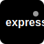
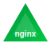
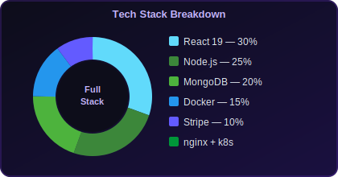
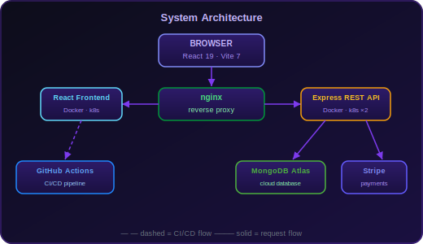
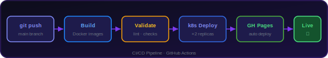

<p align="center">
  
</p>

<p align="center">
  
  &nbsp;
  
  &nbsp;
  
  &nbsp;
  
</p>

<br/>

> **Canteen** is a full-stack food ordering web application.  
> Students browse the menu, add to cart, and check out via a secure Stripe-powered flow.  
> Two containerised services — a React frontend served via nginx, and a Node/Express REST API backed by MongoDB Atlas — orchestrated with Kubernetes and deployed automatically via GitHub Actions.

<br/>

<p align="center">
  
</p>

---

## ◈ Stack

<p align="center">
  
  &nbsp;&nbsp;
  
  &nbsp;&nbsp;
  
  &nbsp;&nbsp;
  
  &nbsp;&nbsp;
  
  &nbsp;&nbsp;
  
  &nbsp;&nbsp;
  
  &nbsp;&nbsp;
  
  &nbsp;&nbsp;
  
  &nbsp;&nbsp;
  
  &nbsp;&nbsp;
  
</p>

<br/>

| Layer | Technology |
|:--|:--|
| 🎨 &nbsp;Frontend | React 19 · React Router DOM 7 · Vite 7 |
| ⚙️ &nbsp;Backend | Node.js · Express REST API |
| 🗄️ &nbsp;Database | MongoDB Atlas |
| 💳 &nbsp;Payments | Stripe |
| 🐳 &nbsp;Containers | Docker · Docker Compose |
| ☸️ &nbsp;Orchestration | Kubernetes (×2 replicas each service) |
| 🌐 &nbsp;Web Server | nginx (reverse proxy + static serve) |
| 🔄 &nbsp;CI/CD | GitHub Actions → GitHub Pages |

---

## ◈ Tech Breakdown

<p align="center">
  
</p>

---

## ◈ Architecture

<p align="center">
  
</p>

---

## ◈ CI/CD Pipeline

<p align="center">
  
</p>

---

## ◈ Run It

### ⚡ Docker Compose *(one command)*

```bash
docker-compose up --build
```

Serves the full stack at **http://localhost**

### 🔧 Without Docker

```bash
# Terminal 1 — Frontend
npm install && npm run dev            # → http://localhost:5173

# Terminal 2 — Backend
cd backend && npm install && node server.js    # → http://localhost:5001
```

---

## ◈ Kubernetes

```bash
kubectl apply -f k8s/      # deploy 2 replicas of each service
kubectl get pods            # verify they're running
```

---

## ◈ Environment Variables

**`backend/.env`**
```env
PORT=5001
MONGO_URL=your_mongodb_connection_string
STRIPE_SECRET_KEY=your_stripe_secret_key
```

**`.env`** *(project root)*
```env
VITE_STRIPE_PUBLIC_KEY=your_stripe_publishable_key
```

> Neither file is committed — both listed in `.gitignore`

---

## ◈ Test Payment

```
Card    4242 4242 4242 4242
Expiry  12/28
CVC     123
```

---

## ◈ Project Structure

```
Canteen/
├── .github/workflows/           ← CI/CD pipeline
├── backend/
│   └── server.js                ← Express REST API
├── k8s/
│   ├── backend-deployment.yaml
│   └── frontend-deployment.yaml
├── svg/                         ← icons, badges, charts
├── src/
│   ├── App.jsx
│   └── main.jsx
├── Dockerfile                   ← Frontend container
├── docker-compose.yml
└── nginx.conf
```

---

## ◈ License

Apache 2.0 — see [`LICENSE`](./LICENSE)

<br/>

<p align="center">
  
</p>
